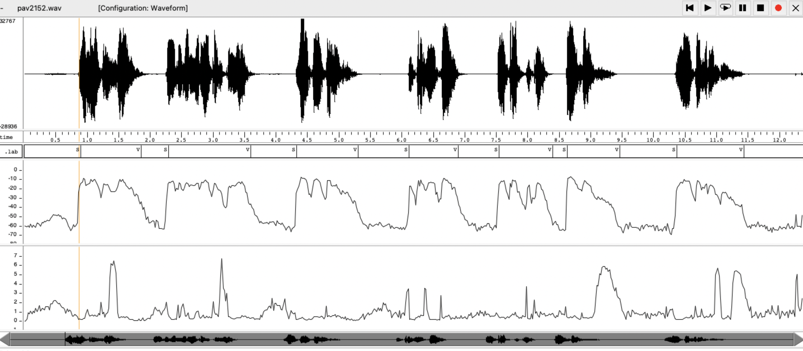
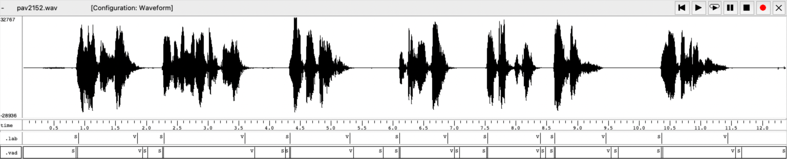
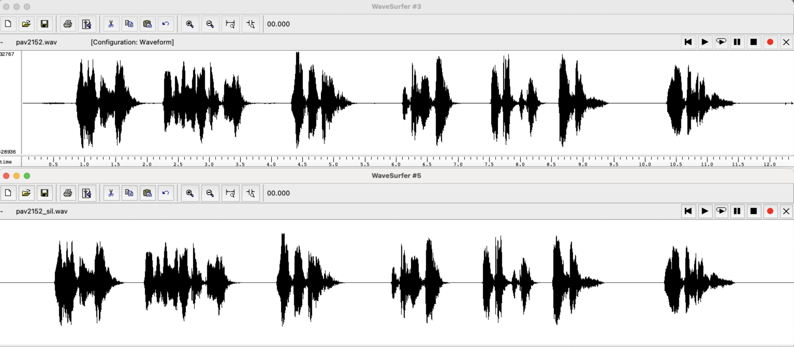
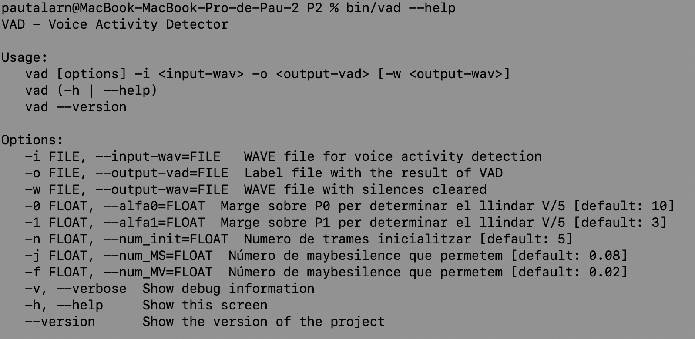

PAV - P2: detección de actividad vocal (VAD)
============================================

Esta práctica se distribuye a través del repositorio GitHub [Práctica 2](https://github.com/albino-pav/P2),
y una parte de su gestión se realizará mediante esta web de trabajo colaborativo.  Al contrario que Git,
GitHub se gestiona completamente desde un entorno gráfico bastante intuitivo. Además, está razonablemente
documentado, tanto internamente, mediante sus [Guías de GitHub](https://guides.github.com/), como
externamente, mediante infinidad de tutoriales, guías y vídeos disponibles gratuitamente en internet.


Inicialización del repositorio de la práctica.
----------------------------------------------

Para cargar los ficheros en su ordenador personal debe seguir los pasos siguientes:

*	Abra una cuenta GitHub para gestionar esta y el resto de prácticas del curso.
*	Cree un repositorio GitHub con el contenido inicial de la práctica (sólo debe hacerlo uno de los
	integrantes del grupo de laboratorio, cuya página GitHub actuará de repositorio central del grupo):
	-	Acceda la página de la [Práctica 2](https://github.com/albino-pav/P2).
	-	En la parte superior derecha encontrará el botón **`Fork`**. Apriételo y, después de unos segundos,
		se creará en su cuenta GitHub un proyecto con el mismo nombre (**P2**). Si ya tuviera uno con ese 
		nombre, se utilizará el nombre **P2-1**, y así sucesivamente.
*	Habilite al resto de miembros del grupo como *colaboradores* del proyecto; de este modo, podrán
	subir sus modificaciones al repositorio central:
	-	En la página principal del repositorio, en la pestaña **:gear:`Settings`**, escoja la opción 
		**Collaborators** y añada a su compañero de prácticas.
	-	Éste recibirá un email solicitándole confirmación. Una vez confirmado, tanto él como el
		propietario podrán gestionar el repositorio, por ejemplo: crear ramas en él o subir las
		modificaciones de su directorio local de trabajo al repositorio GitHub.
*	En la página principal del repositorio, localice el botón **Branch: master** y úselo para crear
	una rama nueva con los primeros apellidos de los integrantes del equipo de prácticas separados por
	guion (**fulano-mengano**).
*	Todos los miembros del grupo deben realizar su copia local en su ordenador personal.
	-	Copie la dirección de su copia del repositorio apretando en el botón **Clone or download**.
		Asegúrese de usar *Clone with HTTPS*.
	-	Abra una sesión de Bash en su ordenador personal y vaya al directorio **PAV**. Desde ahí, ejecute:

		```.sh
		git clone dirección-del-fork-de-la-práctica
		```

	-	Vaya al directorio de la práctica `cd P2`.

	-	Cambie a la rama **fulano-mengano** con la orden:

		```.sh
		git checkout fulano-mengano
		```

*	A partir de este momento, todos los miembros del grupo de prácticas pueden trabajar en su directorio
	local del modo habitual, usando el repositorio remoto en GitHub como repositorio central para el trabajo colaborativo
	de los distintos miembros del grupo de prácticas o como copia de seguridad.
	-	Puede *confirmar* versiones del proyecto en su directorio local con las órdenes siguientes:

		```.sh
		git add .
		git commit -m "Mensaje del commit"
		```

	-	Las versiones confirmadas, y sólo ellas, se almacenan en el repositorio y pueden ser accedidas en cualquier momento.

*	Para interactuar con el contenido remoto en GitHub es necesario que los cambios en el directorio local estén confirmados.

	-	Puede comprobar si el directorio está *limpio* (es decir, si la versión actual está confirmada) usando el comando
		`git status`.

	-	La versión actual del directorio local se sube al repositorio remoto con la orden:

		```.sh
		git push
		```

		*	Si el repositorio remoto contiene cambios no presentes en el directorio local, `git` puede negarse
			a subir el nuevo contenido.

			-	En ese caso, lo primero que deberemos hacer es incorporar los cambios presentes en el repositorio
				GitHub con la orden `git pull`.

			-	Es posible que, al hacer el `git pull` aparezcan *conflictos*; es decir, ficheros que se han modificado
				tanto en el directorio local como en el repositorio GitHub y que `git` no sabe cómo combinar.

			-	Los conflictos aparecen marcados con cadenas del estilo `>>>>`, `<<<<` y `====`. Los ficheros correspondientes
				deben ser editados para decidir qué versión preferimos conservar. Un editor avanzado, del estilo de Microsoft
				Visual Studio Code, puede resultar muy útil para localizar los conflictos y resolverlos.

			-	Tras resolver los conflictos, se ha de confirmar los cambios con `git commit` y ya estaremos en condiciones
				de subir la nueva versión a GitHub con el comando `git push`.


	-	Para bajar al directorio local el contenido del repositorio GitHub hay que ejecutar la orden:

		```.sh
		git pull
		```
	
		*	Si el repositorio local contiene cambios no presentes en el directorio remoto, `git` puede negarse a bajar
			el contenido de este último.

			-	La resolución de los posibles conflictos se realiza como se explica más arriba para
				la subida del contenido local con el comando `git push`.


*	Al final de la práctica, la rama **fulano-mengano** del repositorio GitHub servirá para remitir la
	práctica para su evaluación utilizando el mecanismo *pull request*.
	-	Vaya a la página principal de la copia del repositorio y asegúrese de estar en la rama
		**fulano-mengano**.
	-	Pulse en el botón **New pull request**, y siga las instrucciones de GitHub.


Entrega de la práctica.
-----------------------

Responda, en este mismo documento (README.md), los ejercicios indicados a continuación. Este documento es
un fichero de texto escrito con un formato denominado _**markdown**_. La principal característica de este
formato es que, manteniendo la legibilidad cuando se visualiza con herramientas en modo texto (`more`,
`less`, editores varios, ...), permite amplias posibilidades de visualización con formato en una amplia
gama de aplicaciones; muy notablemente, **GitHub**, **Doxygen** y **Facebook** (ciertamente, :eyes:).

En GitHub. cuando existe un fichero denominado README.md en el directorio raíz de un repositorio, se
interpreta y muestra al entrar en el repositorio.

Debe redactar las respuestas a los ejercicios usando Markdown. Puede encontrar información acerca de su
sintáxis en la página web [Sintaxis de Markdown](https://daringfireball.net/projects/markdown/syntax).
También puede consultar el documento adjunto [MARKDOWN.md](MARKDOWN.md), en el que se enumeran los
elementos más relevantes para completar la redacción de esta práctica.

Recuerde realizar el *pull request* una vez completada la práctica.

Ejercicios
----------

### Etiquetado manual de los segmentos de voz y silencio

- Etiquete manualmente los segmentos de voz y silencio del fichero grabado al efecto. Inserte, a 
  continuación, una captura de `wavesurfer` en la que se vea con claridad la señal temporal, el contorno de
  potencia y la tasa de cruces por cero, junto con el etiquetado manual de los segmentos.

  


- A la vista de la gráfica, indique qué valores considera adecuados para las magnitudes siguientes:

	* Incremento del nivel potencia en dB, respecto al nivel correspondiente al silencio inicial, para
	  estar seguros de que un segmento de señal se corresponde con voz.

	  El nivell de potència mitjà de l'àudio és de -37.584267 dB. En aquest cas, s'observa que l'increment del nivell de potència és d'uns 35 a 40 dB, cosa que suggereix que hi ha un senyal de veu present al senyal d'àudio. Això significa que el nivell de potència del senyal de veu és al voltant de 35 a 40 vegades més gran que el nivell de soroll de fons o silenci inicial. 

	* Duración mínima razonable de los segmentos de voz y silencio.

	 	En aquest àudio, l'etiqueta de silenci més petita correspon a la onzena, i té una duració de 250 ms. La parla de l'àudio és pausada tantmateix aquest silenci és, encara que curt, marcat i per tant és significatiu. 
	 	En quant a la veu idenfifiquem que el segment més petit és de 800 ms. Podem esperar segments de veu molt més petits ja que aquest audio és molt fluid. 

	* ¿Es capaz de sacar alguna conclusión a partir de la evolución de la tasa de cruces por cero? 

		En general, els sons de parla tenen una taxa de creuements per zero més alta que altres sons de fons, com ara el soroll blanc. Això és perquè els sons de parla són produïts per les vibracions de les cordes vocals, cosa que fa que el senyal d'àudio tingui fluctuacions d'amplitud més freqüents i, per tant, més creuaments per zero.
		En la gràfica observem que la tasa de creuments per zero incrementa quan estem en un segment de veu, tanmateix no va lligada necessàriament a l'increment de potència. Els sons sonors no tenen una tasa de creuements per zero tant alta com els sons sords. Això ens podria ajudar, ja que els sons sords poden tenir un nivell de potència baix semblant al del soroll de fons. 


### Desarrollo del detector de actividad vocal

- Complete el código de los ficheros de la práctica para implementar un detector de actividad vocal en
  tiempo real tan exacto como sea posible. Tome como objetivo la maximización de la puntuación-F `TOTAL`.

- Inserte una gráfica en la que se vea con claridad la señal temporal, el etiquetado manual y la detección
  automática conseguida para el fichero grabado al efecto. 

  

- Explique, si existen. las discrepancias entre el etiquetado manual y la detección automática.

  Com s'observa amb la imatge, s'ha aconseguit una detecció relativament precisa, gràcies als diferents paràmetres d'entrada hem pogut 'adaptar' els umbrals en el nostre àudio per tal de detectar la veu amb precisió. Com a primer punt interessant, observem que la detecció allarga més els segments de veu, és a dir, no etiqueta com a silenci fins que no ha estat una estona a silenci. Això és degut a que som prudents a l'hora de passar a silenci. En els canvis de silenci a so, tenim uns etiquetats molt curts, que es corresponen a possible veu, que al final és veu. El mateix passa en el final de la trama de so, que s'etiqueten diversos silencis; són possibles silencis etiquetats finalment com a silenci. 

- Evalúe los resultados sobre la base de datos `db.v4` con el script `vad_evaluation.pl` e inserte a 
  continuación las tasas de sensibilidad (*recall*) y precisión para el conjunto de la base de datos (sólo el resumen).


### Trabajos de ampliación

#### Cancelación del ruido en los segmentos de silencio

- Si ha desarrollado el algoritmo para la cancelación de los segmentos de silencio, inserte una gráfica en la que se vea con claridad la señal antes y después de la cancelación (puede que `wavesurfer` no sea la mejor opción para esto, ya que no es capaz de visualizar varias señales al mismo tiempo).

   Per tal de posar a zero aquells valors que són identificats com a silenci cal realitzar els passos següents. En primer lloc, cal definir dues variables que són buffer i buffer_zero de la mida de cada trama. La primera servirà per anar-se omplint de les diferents trames que anem rebent del senyal de veu d'entrada. Ens anem guardant la informació d'entrada a buffer per cada iteració al while mitjançant:
  ```c
  n_read = sf_read_float(sndfile_in, buffer, frame_size);
  ```
  A més a més, per cada iteració al bucle per cada lectura de trama ens anem guardant la informació del buffer sndfile_out, és a dir al senyal .wav de sortida mitjançant:
  ```c
  if (sndfile_out != 0)
    {
      sf_write_float(sndfile_out, buffer, frame_size);
    }
  ```
  Per d’altra banda, el buffer_zero posa a zero tots els valors equivalents a la longitud de una trama mitjançant: 
  ```c
  for (i = 0; i < frame_size; ++i)
  {
    buffer_zeros[i] = 0.0F; // Posem tots els valors a 0 del buffer_zero[i].
  }
  ```


  I, si durant les iteracions de trames en trobem alguna que ens porta a silenci, apliquem:
  ```c
  if (sndfile_out != 0 && state == ST_SILENCE)
    {
      sf_seek(sndfile_out, -frame_size, SEEK_CUR);
      sf_write_float(sndfile_out, buffer_zeros, frame_size);
    }
  ```
  Com que ja havíem escrit la trama, ara, aquesta cal reemplaçar-la per valors de zero. Per tant, amb la funció sf_seek retornem al principi de la trama que acabàvem de posar i l´omplim amb valors equivalents al zero que extraiem de la trama buffer_zero.
  Com podem observar tots aquests processos només es realitzen en cas que l´usuari ho hagi indicat per línia de comandaments.

  


#### Gestión de las opciones del programa usando `docopt_c`

- Si ha usado `docopt_c` para realizar la gestión de las opciones y argumentos del programa `vad`, inserte
  una captura de pantalla en la que se vea el mensaje de ayuda del programa.

  Observem que, en primer lloc, s'indica els fitxers que entrem per teclat i els que en surten (.vad i .wav) A més a més s'ha afegit les variables alfa0 i alfa1 per indicar quan hem de sumar a la mitjana de la potència per trobar un valor llindar òptim i adequat en la detecció de veu. D'altra banda, com que el llindar de potència es calcula a partir d'una mitjana de la potència de les primeres trames en aquest cas, estem indicant el nombre de trames que utilitzarem per inicialitzar i fer el càlcul de potència. També s'afegeixen dues variables noves (num_MS i la num_MV) que ens ajuden a marcar el temps màxim en què ens podem mantenir l'estat de MT_Silence o de MY_Voice.

   


### Contribuciones adicionales y/o comentarios acerca de la práctica

- Indique a continuación si ha realizado algún tipo de aportación suplementaria (algoritmos de detección o 
  parámetros alternativos, etc.).

- Si lo desea, puede realizar también algún comentario acerca de la realización de la práctica que
  considere de interés de cara a su evaluación.

  El nostre codi es vertebra bàsicament per tres canvis importants que influencien fortament el resultat final del detector.

1. El primer canvi important és la forma en què es calcula la potència. En el nostre cas no agafe directament la potència de la primera trama com a llindar de potència sinó que fem una mitja de potència de les "num_init" trames. A més a més, posteriorment fem el càlcul dels llindars de detecció:
  ```c
  P0= Mitja_de_la_potència * alfa0;
  vad_data->P0 = 10 * log10(vad_data->pot_total / t) + vad_data->alfa0;
  P1= Mitja_de_la_potència * alfa1;
  vad_data->P1 = 10 * log10(vad_data->pot_total / t) + vad_data->alfa1;
  ````

2. A més a més, en el nostre cas s'afegeix un control d'encreuaments per zero per tal de no identificar com a silenci una trama sords amb un nivell de potència baix. Com què els sons sords tenen un zcr molt gran ens permet identificar-los fàcilment. Però, igual que amb la potència, per calcular el llindar, no agafem el valor de la primera trama sinó que fem una mitjana de les "num_init" primeres trames. A aquesta mitja, hi hem afegit un valor beta imposat per l'usuari per tal de fer més eficient el sistema. Quan estem en una trama de veu i la potència és més baixa que el valor llindar, però té una tassa d'encreuaments per zero superiors que la del llindar, fem que aquesta es mantingui a veu.
 ```c
 case ST_VOICE:
  printf("Estat: ST_Voice\n");
  vad_data->indef = 0;
   
    if (f.p < vad_data->P1 && vad_data->zcr > f.zcr-30)
    {
      vad_data->indef++;
      vad_data->state = MY_SILENCE;
      
    }
    break;
 `````

3. Un sistema per ser robustos dabant de sorolls de poca duració o de silencis curts entre lletres. Per aquesta raó s’han creat dos nous estats, MY_SILENCE i el MY_VOICE. Permetem que l’estat en que es trobi la trama en un cert moment estigui indefinit durant un cert període de temps que indica l’usuari mitjançant els “”Num_MS” i els “Num_MV”. Si durant aquets trams de trànsit la senyal torna a recuperar els valors que tenia abans, fem que la trama torni a l’estat que estava anteriorment i es posa les trames que han estat marcades com indefinides a l’estat en aquest estat anterior. Si, per contra, la següent trama continua amb valors diferents als mmarcat per l’umbral, aquesta se’sepra un cert temps abans prendre la decisió de canviar de l’estat en què estava a l’altre. 
```c
case MY_VOICE:
  printf("Estat: My_VOICE\n");
    if (f.p > vad_data->P1){
    printf("indef= %d \n", vad_data->indef);
     printf("%f \n", vad_data->num_MV);
     printf("%f \n", vad_data->indef*vad_data->frame_length/vad_data->sampling_rate);
      if(vad_data->indef*vad_data->frame_length/vad_data->sampling_rate < vad_data->num_MV){
        vad_data->indef++;

        printf("Sumo");
    }else{
      vad_data->state = ST_VOICE;
      vad_data->indef= 0;
      }
    } else if (f.p < vad_data->P1){
      vad_data->indef = 0;
      vad_data->state = ST_SILENCE;
    }
break;
```

### Antes de entregar la práctica

Recuerde comprobar que el repositorio cuenta con los códigos correctos y en condiciones de ser 
correctamente compilados con la orden `meson bin; ninja -C bin`. El programa generado (`bin/vad`) será
el usado, sin más opciones, para realizar la evaluación *ciega* del sistema.


